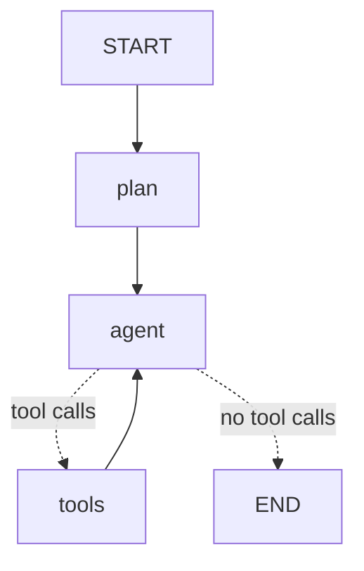

# Agentic SQL Query Engine

Ask a business question in plain English. A Claude agent plans the approach, queries
separate ERP and CRM databases step by step, adapts to what it finds, and answers with
evidence. Every thought, query and result is streamed to the terminal.

```
uv sync
cp .env.example .env          # add OPENROUTER_API_KEY and a LITELLM_MASTER_KEY (+ optional Langfuse keys)
cp langfuse/.env.example langfuse/.env
docker compose up -d          # once: LiteLLM gateway + Langfuse. Docker restarts them whenever it starts
uv run seed.py                # builds data/erp.db + data/crm.db (deterministic, as of 2026-10-08)
uv run agent.py               # interactive; or: uv run agent.py "your question"
uv run eval.py                # runs the 20-question golden dataset and scores it (--judge adds a faithfulness check)
```

Stack: **LangGraph** runs the agent loop, **Pydantic AI** produces the typed outputs (the plan,
and the eval judge's verdicts), **LiteLLM** is the gateway every model call goes through, and
**Langfuse** traces all of it. Models come through OpenRouter as LiteLLM aliases: `claude-haiku`
(Haiku 4.5, default), `claude-sonnet` (Sonnet 5), `gpt-5-mini`, `gpt-5.4-mini`. Set `MODEL` in `.env`.

Golden dataset results (20 questions, see below):

| Model (LiteLLM alias) | Correct | Faithful* | Avg / slowest | Cost for 20 questions | Misses |
|---|---|---|---|---|---|
| `claude-sonnet` (Sonnet 5) | **20/20** (3 runs in a row) | 16/20 | 40 s / 79 s | ~$1.83 | none |
| `gpt-5-mini` | 19/20 | 17/20 | 87 s / 191 s | ~$0.59 | G04: 3 borderline vendors over the line |
| `claude-haiku` (Haiku 4.5, default) | 18/20 (16–18 across runs) | 12/20 | 26 s / 57 s | ~$0.76 | G04 threshold; G17 overdue filter; lakh/crore slips in prose |
| `gpt-5.4-mini` | 17/20 | 18/20 | 17 s / 36 s | ~$0.46 | G10, G15 ranking; G19 missed the 8 customers with no CRM record |

\* From the first version of the judge, which over-flagged: it listed claims it had checked and found correct. For
example, 3 of Sonnet's 4 flags were "this is fine". The judge now writes its checks into a scratchpad field and lists
only claims that fail; on a test it passes a clean answer and flags exactly a 10x unit slip and a made-up vendor name.
Re-measure with `uv run eval.py --judge`. The judge costs about $1.45 per 20 questions.

The brief asks for Claude, so the GPT models are here as a comparison: the LiteLLM aliases make it a one-line switch.

For a live demo use `MODEL=claude-sonnet`.

## Cost

Typical cost per question (about 4–5 LLM calls; input is ~75% of the bill):

| Model | Per question | Notes |
|---|---|---|
| `gpt-5.4-mini` | ~$0.02 | OpenAI caches resent context automatically |
| `gpt-5-mini` | ~$0.03 | but 60–190 s per question |
| `claude-haiku` | ~$0.04–0.05 | system prompt is below Haiku's 4,096-token caching minimum |
| `claude-sonnet` | ~$0.07–0.30 | system prompt cached; about 27% cheaper than uncached on the heaviest question |

What keeps it down: the model sees at most 25 rows per result (`{{rN.col}}` references still carry every row),
answers are capped at about 150 words, and the system prompt is marked for prompt caching. Through OpenRouter the
cache marker only survives on system and user messages, so the growing tool history can't be cached on Claude.

Spending guidance: run `uv run eval.py spec` (6 questions, ~$0.30 on Haiku) or single IDs while iterating, and the full
20 only before you submit. Use a cheap `JUDGE_MODEL`. Put a credit limit on the OpenRouter key
(openrouter.ai → Keys → edit), so nothing can overspend.

## Sample run (abridged)

```
───── Customers with 3+ unpaid invoices — show me the reason codes and when they last engaged with sales. ─────
╭─ Agent Plan ─────────────────────────────────────────────────────────────────────────────╮
│ Thought: ... "Unpaid invoices" means status = 'unpaid'. Link via accounts.erp_customer_id │
│ Plan:                                                                                     │
│ 1. ERP: customers with 3+ unpaid invoices, collect reason codes                           │
│ 2. Take the customer IDs from step 1                                                      │
│ 3. CRM: most recent activity for those customers                                          │
│ 4. Combine on customer_id = erp_customer_id                                               │
╰───────────────────────────────────────────────────────────────────────────────────────────╯
Agent Thought: I'll find customers with 3+ unpaid invoices, their reason codes, and last sales engagement.
Agent Executed (step 1): query_erp
  SELECT i.customer_id, c.name, COUNT(*) AS unpaid_count, GROUP_CONCAT(DISTINCT i.reason_code, ', ') ...
Observation (error): OperationalError('DISTINCT aggregates must have exactly one argument')
Agent Thought: Let me fix the SQL syntax:
Agent Executed (step 2): query_erp
  SELECT i.customer_id, c.name, COUNT(*) AS unpaid_count, GROUP_CONCAT(i.reason_code, ', ') ...
Observation: 8 row(s)
  C0043  Kulkarni Machine Tools  5  DISPUTE_PRICING, DISPUTE_PRICING, DISPUTE_PRICING, CASH_FLOW
  C0172  Rao Chemicals           5  CASH_FLOW, DELIVERY_SHORTFALL, DELIVERY_SHORTFALL, PO_MISMATCH, ...
Agent Thought: Found 8 customers with 3+ unpaid invoices. Now I'll get their last sales engagement from CRM:
Agent Executed (step 3): query_crm
  SELECT a.erp_customer_id, a.name, MAX(act.occurred_at) AS last_activity_date, act.type ...
  WHERE a.erp_customer_id IN ('C0043', 'C0172', 'C0015', 'C0095', 'C0039', 'C0076', 'C0077', 'C0089')
Observation: 8 row(s)
╭─ Answer ──────────────────────────────────────────────────────────────────────────────────╮
│ Customer                        Unpaid  Reason Codes                          Last Engagement │
│ Patel Udyog Pvt Ltd (C0076)     3       DELIVERY_SHORTFALL, DISPUTE_PRICING   2026-10-07 call │
│ Kulkarni Machine Tools (C0043)  5       DISPUTE_PRICING, CASH_FLOW            2026-08-05 email│
│ Joshi Chemicals & Co (C0095)    4       PO_MISMATCH, DISPUTE_QUALITY          2026-06-20 call │
│ ...                                                                                        │
│ Why it matters: these 8 customers are blocked cash flow; the codes point to delivery and   │
│ PO problems that need fixing, not just collection calls.                                   │
╰───────────────────────────────────────────────────────────────────────────────────────────╯
3 tool call(s) · 19.9s · anthropic/claude-haiku-4.5
trace: http://localhost:3300/project/nl2sql-agent/traces/...
```

## Agent design



A LangGraph `StateGraph` with three nodes:

| Node | What it does | Shown as |
|---|---|---|
| `plan` | A Pydantic AI agent returns a validated `Plan` (thought, sub-problems, ordered steps) before any data is touched. If the model leaves out a field or mistypes one, the validation error goes back to it for a retry (up to 2). Vague terms ("repeat", "improved") get a concrete definition here. | **Agent Plan** panel |
| `agent` | ReAct step. Claude sees the plan, the schema and every result so far, writes a short observation and either calls tools or gives the final answer. | **Agent Thought**, **Agent Executed (step n): tool** with the SQL |
| `tools` | `ToolNode` runs the calls (in parallel if there are several). | **Observation** with row count and preview |

How the requirements map to the loop:

- **Decomposition**: the `plan` node always runs first, so every question gets a visible plan.
- **Adaptive multi-step querying**: ERP and CRM are separate SQLite files, so no single SQL
  statement can join them. The agent has to run a query on one side, read the IDs, and
  build the next query from them. Each `agent` turn sees all prior results and decides the
  next query, so it changes course when a result is empty or surprising.
- **Deterministic ID hand-off**: every tool result is stored under a reference (`r1`, `r2`, …).
  A later query writes `WHERE customer_id IN ({{r3.erp_customer_id}})`, and the tool fills in
  every value of that column, including rows beyond the 100 the model was shown. The model never
  copies IDs by hand. That used to drop IDs on Haiku, and made anti-joins like "customers with no
  CRM activity" (214 IDs) impossible under the row cap. The trace shows the reference, not
  the expanded list.
- **Error recovery**: `ToolNode(handle_tool_errors=True)` turns SQL errors (bad column,
  timeout, multiple statements) into messages. The prompt tells the agent to read the error,
  check the schema and retry with a fix.
- **Budget**: after 12 tool rounds the agent is forced (`tool_choice="none"`) to answer with
  what it has and say what's missing.
- **Follow-ups**: an `InMemorySaver` checkpointer keeps the conversation per thread, so
  "now only Pune customers" works in the REPL. `/new` resets.
- **Schema awareness**: the system prompt carries the live DDL of both databases, comments
  included. The comments are the data dictionary (status values, how to compute days late,
  the ERP↔CRM link).

Observability: set `LANGFUSE_PUBLIC_KEY` and `LANGFUSE_SECRET_KEY` (plus `LANGFUSE_BASE_URL`
if self-hosted) and every run is traced in Langfuse through its LangChain callback. To run
Langfuse locally:

```
cp langfuse/.env.example langfuse/.env && docker compose up -d   # UI: http://localhost:3300
```

If Langfuse isn't reachable, the agent prints one line and runs without tracing.

The org, project, API keys and login (`admin@local.dev` / the password in `langfuse/.env`)
are created on first start. Put the matching keys in the root `.env` (see `.env.example`).
`docker-compose.yml` is the official upstream file; `docker-compose.override.yml` moves the UI
to port 3300 and keeps every port bound to localhost.

Each trace shows the plan, each LLM call with tokens and cost, each tool call with its SQL and result, and
latency per node. Runs are grouped by conversation (session = REPL thread), and the CLI
prints the trace URL after each answer. `eval.py` attaches an `eval_pass` score to each
question's session, so regressions show up next to the trace. Without the keys, tracing is off.

Safety: LLM-written SQL runs on a read-only connection (`mode=ro`) with an authorizer that
blocks `ATTACH`, a 10-second timeout, one statement per call, and results capped at 100 rows
(the agent is told to aggregate in SQL).

Why plain LangGraph with an explicit graph instead of `create_react_agent`: the reasoning
loop is the deliverable, so it's written out where you can see it.

### LLM layer: LiteLLM + Pydantic AI

```
LangGraph agent (ChatOpenAI) ─┐
Pydantic AI planner ──────────┼──► LiteLLM proxy :4000 ──► OpenRouter ──► Claude Haiku 4.5 / Sonnet 5
Pydantic AI eval judge ───────┘    aliases, retries, fallback, one key
```

- **LiteLLM proxy** (`litellm/config.yaml`) is the only thing that holds the OpenRouter key.
  The app authenticates with `LITELLM_MASTER_KEY` and asks for an alias (`claude-haiku`,
  `claude-sonnet`). The proxy retries transient errors twice, then falls back to the other
  model. Switching provider (Anthropic direct, Bedrock, Vertex) or adding a model is a config
  change, not a code change.
- **Pydantic AI** handles every call whose output must match a schema: the planner
  (`Plan`) and the eval judge (`Verdict`). It reaches LiteLLM through its `LiteLLMProvider`.
  `Agent.instrument_all()` sends its spans to Langfuse, where they nest inside the LangGraph
  trace, so one trace shows planner, agent and tools together.
- The gateway runs as the `litellm` service in the root `docker-compose.yml` (official image, `restart: always`).
  The agent checks it on startup and says what to do if it's down. Without Docker:
  `uvx --env-file .env --from 'litellm[proxy]' litellm --config litellm/config.yaml --port 4000`.
- **No proxy?** Remove `LLM_BASE_URL`/`LLM_API_KEY` from `.env` and the same code talks to
  OpenRouter directly (`MODEL=anthropic/claude-haiku-4.5`). Both paths use the same
  OpenAI-compatible client, so there's no second code path.

## Tools

| Tool | Purpose |
|---|---|
| `query_erp(sql)` | Raw read-only SQL on ERP |
| `query_crm(sql)` | Raw read-only SQL on CRM |
| `find_customers_by_criteria(...)` | Customer metrics in one call: invoices in a window, lifetime spend, outstanding, overdue, first/last invoice, dormancy |
| `find_invoices(...)` | Invoices with balance, days past due, reason code; optionally one row per line item with SKU |
| `analyze_trends(database, sql, recent_periods)` | Takes `(entity, period, value)` rows; returns slope, recent vs prior average and change per entity |

`analyze_trends` takes SQL rather than raw data, so the model doesn't have to copy hundreds of
rows back into a tool call. `query_erp`, `query_crm` and `analyze_trends` accept
`{{rN.column}}` references to earlier results. A new tool gets a reference for its own output by
returning `remember(cols, rows)` instead of `to_json(cols, rows)`.

### Adding a tool

Tools are plain functions in `tools.py`. The type hints become the JSON schema and the
docstring becomes the description the model reads. Example: add this to `tools.py`
and append it to `TOOLS`. Nothing else changes.

```python
@tool(parse_docstring=True)
def calculate_roi_by_customer(customer_ids: list[str], months: int = 12, margin_pct: float = 25,
                              cost_per_touch: float = 1500) -> str:
    """Return on sales effort per customer: gross margin earned vs. cost of CRM touches over the last N months.

    Args:
        customer_ids: ERP customer IDs to evaluate.
        months: Look-back window in months.
        margin_pct: Assumed gross margin on revenue, in percent.
        cost_per_touch: Assumed INR cost of one CRM activity (call, email or meeting).
    """
    ids, window = ",".join("?" * len(customer_ids)), f"-{months} months"
    _, revenue = run_sql("erp.db", f"SELECT customer_id, SUM(total_amount) FROM invoices WHERE customer_id IN ({ids}) "
                         "AND invoice_date >= date((SELECT as_of FROM meta), ?) GROUP BY 1", [*customer_ids, window])
    _, touches = run_sql("crm.db", "SELECT a.erp_customer_id, COUNT(*) FROM activities t JOIN accounts a ON a.id = "
                         f"t.account_id WHERE a.erp_customer_id IN ({ids}) AND t.occurred_at >= "
                         "date((SELECT as_of FROM meta), ?) GROUP BY 1", [*customer_ids, window])
    revenue, touches = dict(revenue), dict(touches)
    rows = []
    for cid in customer_ids:
        margin, cost = revenue.get(cid, 0) * margin_pct / 100, touches.get(cid, 0) * cost_per_touch
        rows.append([cid, revenue.get(cid, 0), margin, touches.get(cid, 0), cost, margin / cost if cost else None])
    return remember(["customer_id", "revenue", "gross_margin", "touches", "sales_cost", "roi_multiple"], rows)

TOOLS = [query_erp, query_crm, find_customers_by_criteria, find_invoices, analyze_trends, calculate_roi_by_customer]
```

Then ask: *"What's the ROI on sales effort for our top 5 customers?"*

## Golden dataset

`golden.json` holds 20 questions with known-correct answers: the 5 from the brief plus the
sales director's question (tagged `spec`), and 14 more covering simple lookups, totals,
rankings, ERP↔CRM hand-offs, time windows, trends, and traps (duplicate names, customers with
no CRM record, a question whose correct answer is "nobody"). Each item has:

| Field | Meaning |
|---|---|
| `question` | What the agent is asked |
| `tags`, `difficulty` | e.g. `cross-db`, `temporal`, `data-quality`; easy / medium / hard |
| `answer_type` | `ids` (a set of customer/vendor/SKU IDs), `value` (a number, with `tolerance_pct`) or `text` |
| `reference_sql` | The query that defines the right answer (on `erp.db` with `crm.db` attached as `crm`; `:as_of` = dataset date) |
| `expected` | The frozen answer that query returns on the seeded data |
| `notes` | The interpretation used and the traps involved |

```
uv run eval.py                  # all 20
uv run eval.py G04 G16          # by id
uv run eval.py spec             # by tag
uv run eval.py --freeze         # recompute `expected` after changing questions or data
uv run eval.py --judge          # also run the faithfulness judge (JUDGE_MODEL, e.g. claude-sonnet)
```

Scoring (correctness):
- **`ids`**: the agent ends every answer with an `Answer IDs:` line. Every expected ID must be
  on it, and at least 75% of the IDs on it must be expected. IDs mentioned elsewhere for
  context ("C0009 was excluded") don't count.
- **`value`**: some number in the answer (₹, lakh/L, crore/Cr understood) must be within tolerance.
- **`text`**: the expected text must appear in the answer.

Faithfulness (`--judge`): a Pydantic AI judge gets the question, every tool call the agent
made (SQL and result) and the final answer, and returns a typed `Verdict` listing any ID, name,
number or date the evidence doesn't back. Arithmetic and unit conversions of real values count
as supported. This catches failures that correct IDs hide, e.g. Sonnet once put the right
vendor IDs next to invented vendor names. Both scores (`eval_pass`, `faithful`) are attached
to the question's Langfuse session.

Before running, `eval.py` re-runs every reference query and refuses to start if the data no
longer matches the frozen answers.

To add a question: append an item with `expected: null`, run `uv run eval.py --freeze`, and
check the frozen answer by hand. If it needs specific data to exist, plant it in `seed.py`
(see `PROFILES`) and add it to the self-check at the end of `main()`.

## Database

Synthetic data: two SQLite files generated by `seed.py`. They aren't from a public
dataset: names, cities, GSTINs, products and payment behaviour are modelled on an Indian B2B
industrial distributor. The RNG seed and the dataset's "today" (`meta.as_of` = 2026-10-08) are
fixed, so every run produces byte-identical files and the golden answers stay valid.
`AS_OF=YYYY-MM-DD uv run seed.py` gives a different "today"; re-freeze the golden answers
afterwards.

**ERP** (`data/erp.db`)
- `customers` (220): id `C0001`, name (not unique), city, segment SME/Mid-Market/Enterprise, credit terms
- `invoices` (~2,400): date, due date, total, status paid/partial/unpaid, `reason_code` for overdue ones
- `line_items` (~7,500): SKU, quantity, charged price
- `payments` (~2,550): customer receipts, part payments allowed
- `inventory` (56 SKUs): catalog, list price, stock, supplying vendor
- `vendors` (55) and `purchase_orders` (~450): our purchases plus vendor bill due date and when we paid it
- view `invoice_balance`: invoice + amount paid + balance + days past due

**CRM** (`data/crm.db`)
- `accounts` (219): `erp_customer_id` link, owner rep, tier, check-in cadence
- `contacts` (~560), `activities` (~1,300 calls/emails/meetings), `opportunities` (~150, incl. win-back), `nps_responses` (~340)

Realism built in, so naive approaches fail:
- Duplicate company names in different cities. Joining on name gives wrong answers.
- CRM names differ from ERP ("M/s …", "Pvt. Ltd.", UPPER CASE). Only `erp_customer_id` is reliable.
- 8 ERP customers have no CRM account; 2 customers have two CRM accounts; 5 CRM prospects aren't in ERP.
- Payer profiles (prompt vs slow), part payments, some missing reason codes, NULL contact on some activities.
- Seasonality: Diwali (Oct–Nov) and fiscal year-end (March) peaks, monsoon dip.

Planted groups give the brief's questions known answers, and `seed.py` asserts the golden
reference queries return exactly them: 10 enterprise accounts far ahead of everyone else, 7 customers
who grew from <₹1L to >₹5L orders, 6 repeat customers owing >₹5L with no contact for 30+ days
(plus 4 decoys contacted recently), 8 customers with 3–5 unpaid invoices, 6 dormant customers
over ₹10L lifetime (plus small dormant decoys), 4 vendors whose bill payment went from 15–35
days late to on time (plus 3 that got worse).

## Files

```
agent.py      graph, prompts, streaming CLI, REPL
tools.py      tool registry and SQL guards
seed.py       schema DDL, data generator, self-check
golden.json   20 questions with reference SQL and expected answers
eval.py       golden-dataset runner and scorer
docker-compose.yml   LiteLLM gateway + Langfuse in one stack
litellm/      LiteLLM proxy config (model aliases, retries, fallbacks)
langfuse/     local Langfuse (official compose file + override)
```
